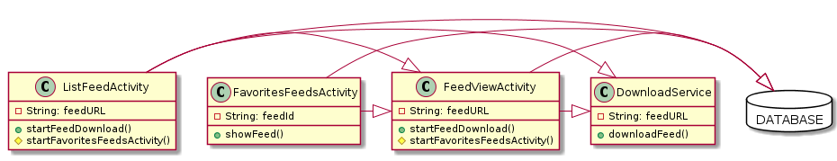
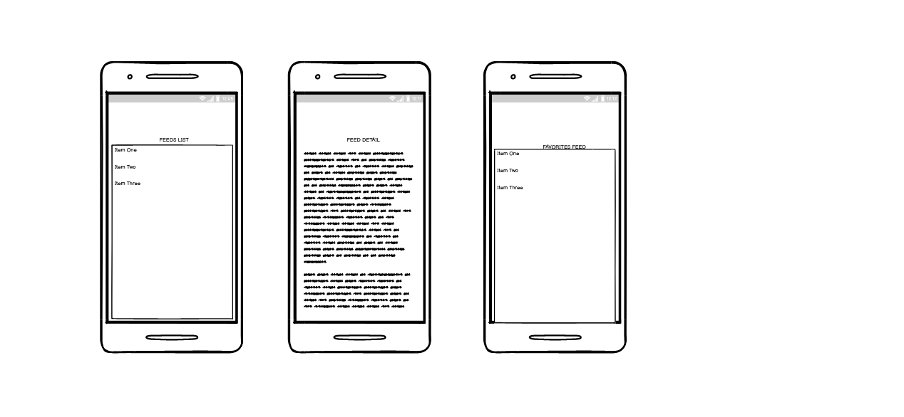

# Capstone Android App Development

This project is for the Coursera Capstone MOOC for "Android App Development", the final part of a series of on-line courses to learn Android development.

A Simple Android  RSS reader will be be built in this project.

The fedd URL is https://stackoverflow.com/feeds/

The user will be shown the list of feeds and can tap on one to read it.

There will be 3 activities where the first is for lsiting the  feeds, the second will be used to list favorites feeds, and the third is for viewing the selected feed.

A service will be used to download the feeds in the background, and this service will broadcast when current feed download is completed.

A locale database will be present to store the favorites feeds.

The main components of the application are visualized in the below picture.

A wireframe of the UI:

